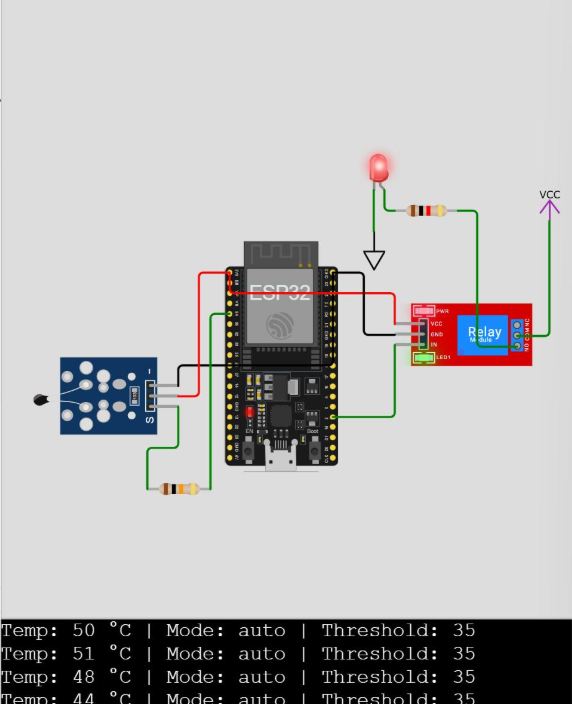

# 🔌 ESP32 Smart LED Control System via MQTT

## 🌡️ Overview
This project uses an **ESP32** to monitor temperature via an **NTC thermistor** and control a **relay-connected LED** in two operating modes:

### 🔁 Auto Mode
- Relay (and LED) **turns ON** if the temperature **exceeds a defined threshold**.  
- Relay **turns OFF** when the temperature **drops below the threshold**.  

### 🎮 Manual Mode
- Relay can be **turned ON/OFF remotely** using MQTT commands from a PC or another MQTT client.  

---



## 🔧 Setup

### 📱 ESP32 (MicroPython)
1. Copy `esp32_code/main.py` to your ESP32.  
2. Connect hardware:
   - **NTC Thermistor + 10kΩ resistor** as a voltage divider → **GPIO34**  
   - **Relay Module control pin** → **GPIO2**  
   - **LED** connected between **NO–COM** on the relay  
3. Run the code on ESP32.  
4. Open **Serial Monitor** to verify:
   - ✅ Wi-Fi connection  
   - ✅ MQTT broker connectivity  

---

### 💻 PC (Python MQTT Controller)
1. Install required library:
   ```bash
   pip install paho-mqtt
